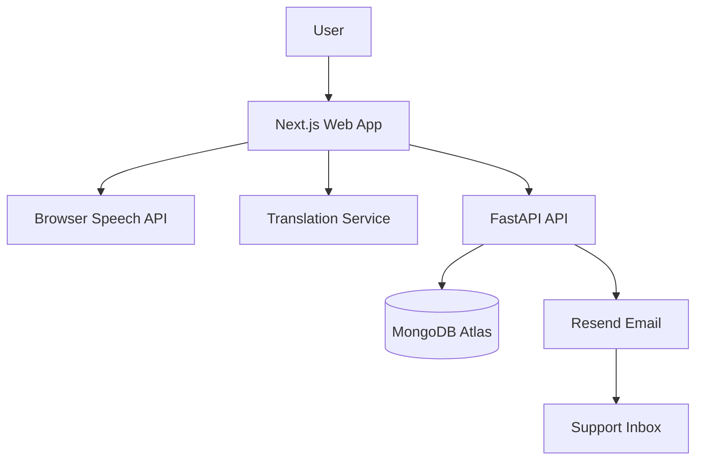

# High Level Design

## Architecture Overview
- Frontend (Next.js) handles recording, translation, validation, and UI using free client-side APIs
- Backend (FastAPI) handles persistence, email, validation, and security
- MongoDB Atlas stores submissions
- Resend free tier sends structured email

## System Diagram

## Service Interactions
- FE calls /api/v1/queries with payload
- API validates, stores, sends email, returns status

## Deployment Architecture
- Vercel hosts frontend
- Render hosts backend
- MongoDB Atlas for data
- Resend for email

## Scaling Strategy
- Stateless API nodes
- Add caching for translation if needed
- Queue for email on heavy load
